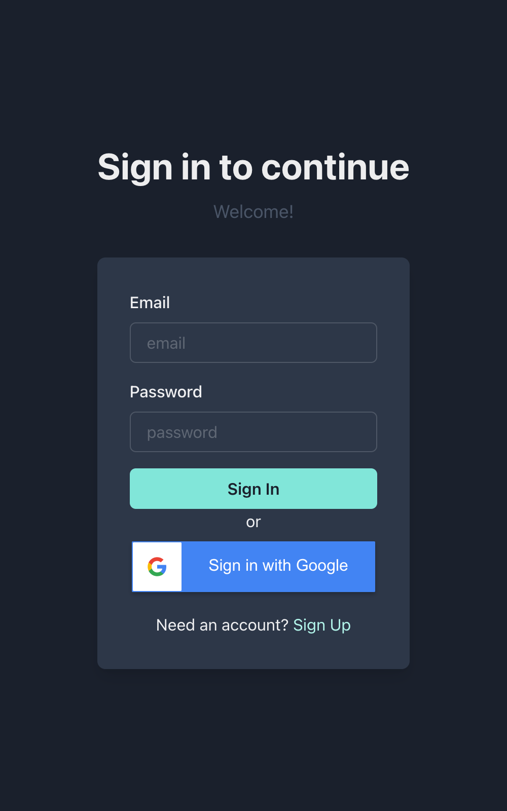
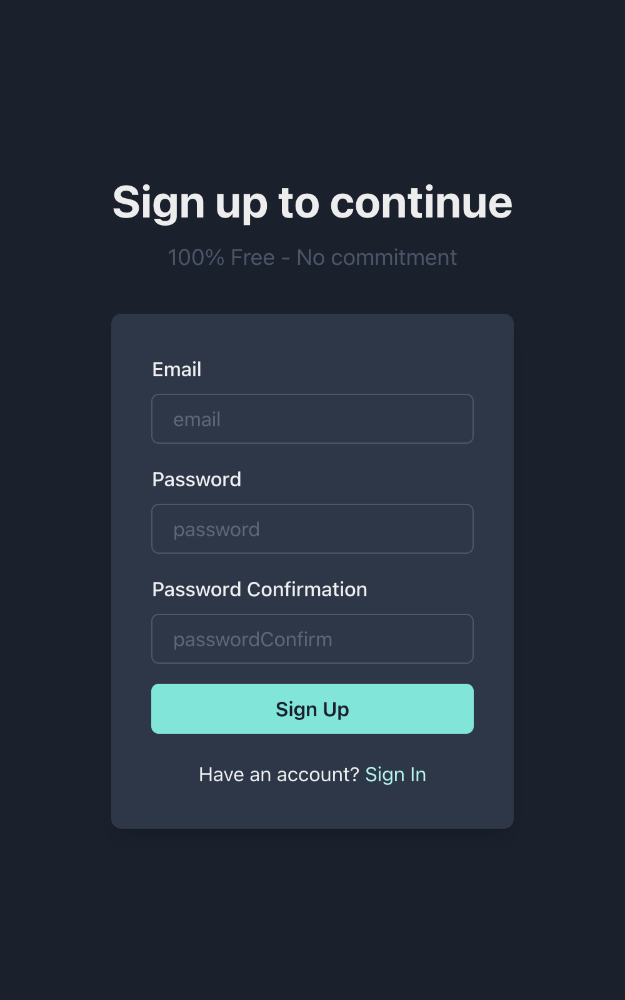
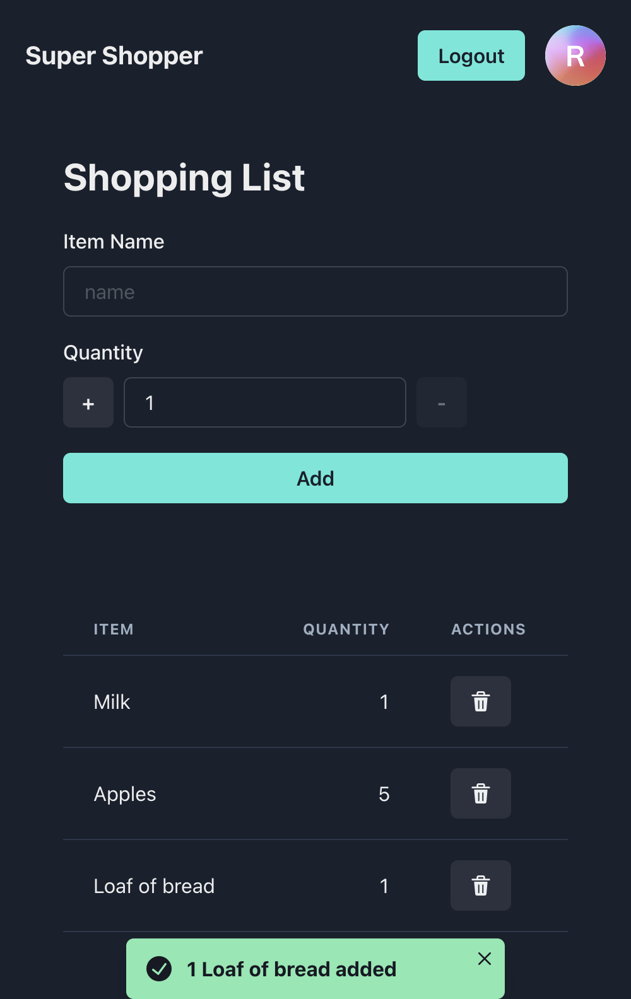
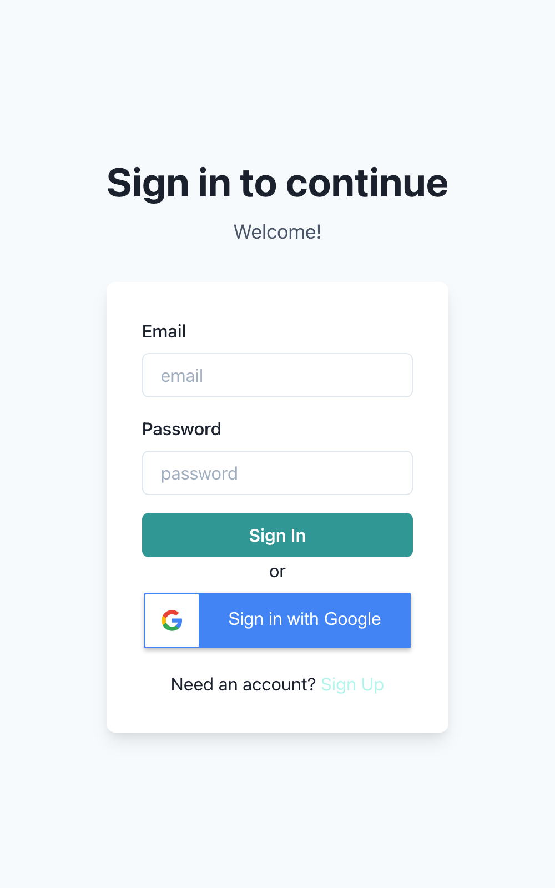
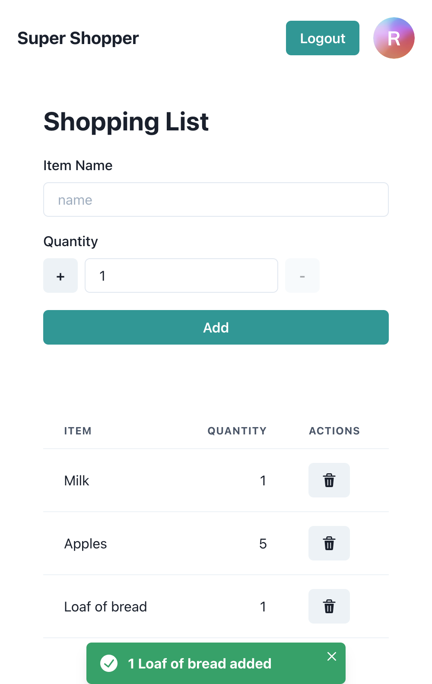

# [Click here for live demo](https://thirsty-elion-5691ef.netlify.app)
## Screenshots
Dark mode:

  
   
  

 
Light mode: 

  
  
  

  
   
   

# Description
This project allows a user to login and access a private shopping list that they can edit and view on any device. The shopping list is updated in realtime - without the need for page refreshing. I chose this project because I wanted to learn how to use Google Firebase, specifically their Realtime Database and Authentication features, in a React project. I had also never used the language Typescript before, and I wanted to see what that was like. From idea to finished product, this project took me about 3 days.  
   

## Features
- Google Account Sign up/Login
- Email & Password Sign up/Login
- Realtime shopping list (items, quantities)
- User profile picture
- Logout functionality
- Dark mode/Light mode chosen from system color
- Client-side rendering, with page routing thanks to [React Router](https://reactrouter.com/)
   

## Main Tech Used
- [Create React App](https://create-react-app.dev/)
- [Typescript](https://www.typescriptlang.org/)
- [Chakra UI](https://chakra-ui.com/)
- [Firebase](https://firebase.google.com/)  
   
   

# Running it yourself
In the project directory, you can run:

### `yarn`
This will install needed dependencies  
If you don't have yarn, use `npm install --global yarn` if you have NPM, otherwise use `brew install yarn` if you're on a Mac.

Now you can choose one of the following commands. I'd recommend this first one:
### `yarn start`

Runs the app in the development mode.\
Open [http://localhost:3000](http://localhost:3000) to view it in the browser.

The page will reload if you make edits.\
You will also see any lint errors in the console.

### `yarn test`

Launches the test runner in the interactive watch mode.\
See the section about [running tests](https://facebook.github.io/create-react-app/docs/running-tests) for more information.

### `yarn build`

Builds the app for production to the `build` folder.\
It correctly bundles React in production mode and optimizes the build for the best performance.

The build is minified and the filenames include the hashes.\
Your app is ready to be deployed!

See the section about [deployment](https://facebook.github.io/create-react-app/docs/deployment) for more information.

### `yarn eject`

**Note: this is a one-way operation. Once you `eject`, you can’t go back!**

If you aren’t satisfied with the build tool and configuration choices, you can `eject` at any time. This command will remove the single build dependency from your project.

Instead, it will copy all the configuration files and the transitive dependencies (webpack, Babel, ESLint, etc) right into your project so you have full control over them. All of the commands except `eject` will still work, but they will point to the copied scripts so you can tweak them. At this point you’re on your own.

You don’t have to ever use `eject`. The curated feature set is suitable for small and middle deployments, and you shouldn’t feel obligated to use this feature. However we understand that this tool wouldn’t be useful if you couldn’t customize it when you are ready for it.

## Learn More

You can learn more in the [Create React App documentation](https://facebook.github.io/create-react-app/docs/getting-started).
